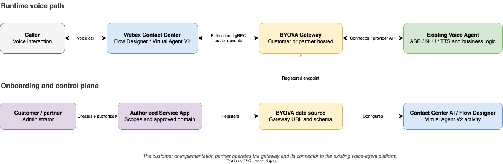

# Evaluating BYOVA for Your Existing Voice Agent

This guide is for Webex Contact Center customers and implementation partners deciding
whether to connect an existing voice virtual agent through BYOVA. It explains where this
gateway fits, what each party typically owns, and what to prove before investing in
production engineering.

This repository is functional sample code. It is not a managed connector, a supported
deployment architecture, or a Cisco-certified production capacity baseline.

## How the Gateway Fits

BYOVA lets Webex Contact Center stream caller audio and conversation events to an external
voice virtual agent through a secure, bidirectional gRPC interface. This gateway implements
the Webex-facing interface and translates between the BYOVA protocol and a
provider-specific connector. Your voice agent remains in the environment where you or your
provider operate it.

At runtime, Webex connects to the registered gateway endpoint, the gateway validates the
signed request token, and the connector exchanges audio and events with the existing
voice-agent platform. BYOVA uses the BYODS control plane for Service App authorization and
data-source registration.

## Is This Approach a Fit?

Before adopting this example, confirm that:

- Your voice-agent platform supports real-time voice interactions or exposes APIs from
  which a real-time connector can be built. A text-only agent also needs an approved ASR/TTS
  media layer.
- A connector can translate caller audio, responses, DTMF, conversation events,
  cancellation, terminal events, and human escalation between BYOVA and your platform.
- The combined Webex Contact Center, gateway, network, and voice-agent path can meet your
  caller-experience latency and audio-quality requirements.
- Your provider can support the expected concurrent sessions, regional deployment, quotas,
  data residency, and production support model.
- You can operate a public TLS endpoint on an authorized domain and own its security,
  monitoring, incident response, and capacity.
- Current Webex Contact Center licensing, entitlement, platform, region, language, codec,
  and transcript requirements support your use case.

Webex capabilities and commercial availability can change. Confirm current requirements in
the [BYOVA developer guide](https://developer.webex.com/webex-contact-center/docs/bring-your-own-virtual-agent),
the [Virtual Agent-Voice configuration guide](https://help.webex.com/en-us/article/n6gaghu/Configure-Virtual-Agent-Voice-in-Webex-Contact-Center),
and with your Cisco account or support team before committing to a production design.

## Typical Responsibilities

| Party | Typical responsibility |
| --- | --- |
| Webex Contact Center | Webex media path, BYOVA schema and interface, BYODS authorization framework, and Control Hub and Flow Designer capabilities. |
| Customer or implementation partner | Gateway connector, deployment, public endpoint, configuration, security, scaling, observability, on-call operations, and compliance. |
| Voice-agent provider | Voice-agent runtime, APIs or SDKs, quotas, latency, availability, regional support, credentials, and provider-side troubleshooting. |
| Customer administrator | Service App authorization, data-source approval, Contact Center AI configuration, and production call-flow changes. |

Confirm the support boundary for your specific commercial agreement. The customer or
implementation partner owns production architecture, sizing, hardening, and operations for
a derivative of this sample.

## Before You Start

1. Confirm that BYOVA is available and entitled for the target Webex Contact Center
   organization and region.
2. Obtain a sandbox or nonproduction organization for development.
3. Decide who will own the Service App, public gateway endpoint, and voice-agent connector.
4. Create and authorize the Service App, including the Voice Virtual Agent schema and the
   gateway's data exchange domain.
5. Make the gateway available at a public TLS-enabled server URL, then register an `ACTIVE`
   BYOVA data source using that exact URL. Use the same value for
   `jwt_validation.datasource_url` in the gateway configuration.
6. Configure Contact Center AI and add the Virtual Agent V2 activity to a test flow.

Use the current [Service App authorization steps](https://help.webex.com/default/article/5g8s6u),
[BYODS guide](https://developer.webex.com/webex-contact-center/docs/bring-your-own-data-source-cc),
and [BYOVA developer guide](https://developer.webex.com/webex-contact-center/docs/bring-your-own-virtual-agent)
for the Webex onboarding flow.

For a complete first-time walkthrough, including these dependencies in the required order,
follow the
[BYOVA with AWS Lex setup guide](https://developer.webex.com/webex-contact-center/docs/byova-and-aws-lex).

## Recommended Proof of Concept

1. Run this gateway with the local audio connector to validate the Webex-facing setup.
2. Implement a connector for the existing voice-agent API or streaming interface.
3. Verify agent discovery and complete a live end-to-end test call.
4. Validate caller speech, response audio, DTMF, cancellation, normal termination, and
   human-agent escalation.
5. Measure time to first virtual-agent audio, turn latency, audio quality, and connector
   errors under representative traffic.
6. Test invalid authentication, voice-agent timeout, dependency failure, and cleanup.
7. Obtain business and technical acceptance before starting production engineering.

After the proof of concept succeeds, use the
[Productization and Production Readiness Guide](PRODUCTION_READINESS.md) to plan the
engineering and operational work required for production.

## Next Steps

- [Set up the gateway locally](LOCAL_DEVELOPMENT.md)
- [Configure gRPC JWT authentication](JWT_AUTHENTICATION.md)
- [Review the AWS Lex example](https://developer.webex.com/webex-contact-center/docs/byova-and-aws-lex)
- [Return to the project README](../README.md)
